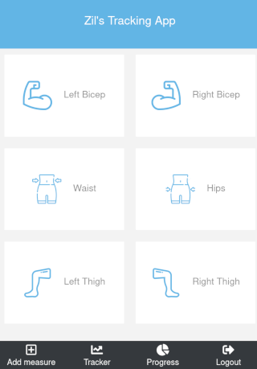

# Tracking App

## Project Description
Tracker app is an application designed to track results using back-end API, which was also custom built for this app ([API Repo](https://github.com/zilton7/tracking-app-backend)). It fetches data such as measurements of Biceps, Thighs, Hip and Waist. It also allows user to post new measurement data.

### Features
- Login with username
- Responsive design that works for Mobile, Tablet and Desktop
- Track measurement data such for Left and Right Biceps, Left and Right Thighs, Hip and Waist
- Post new measurement data

### Built with
- Node.js
- React
- React-DOM
- React-Create-App
- Redux
- npm
- CSS
- ES6
- Ruby on Rails for Backend API ([API Repo](https://github.com/zilton7/tracking-app-backend))

## Live Demo
[Try it out here](https://)

## Getting Started Locally

- Clone the repo `https://github.com/zilton7/tracking-app-frontend.git`
- cd into the project
- Run `npm install` to install dependencies
- In the terminal run `npm start` open up the live server
- Point your browser to http://localhost:3000/ to load the app

### Testing
- To run tests write `npm test` in the terminal

**ZIL NORVILIS**

- Github: 
- Linkedin: 
- Twitter: 

## Contributing

Contributions, issues and feature requests are welcome!

Feel free to check the [issues page](issues/).

## Show your support

Give a ⭐️ if you like this project!

## License

MIT License